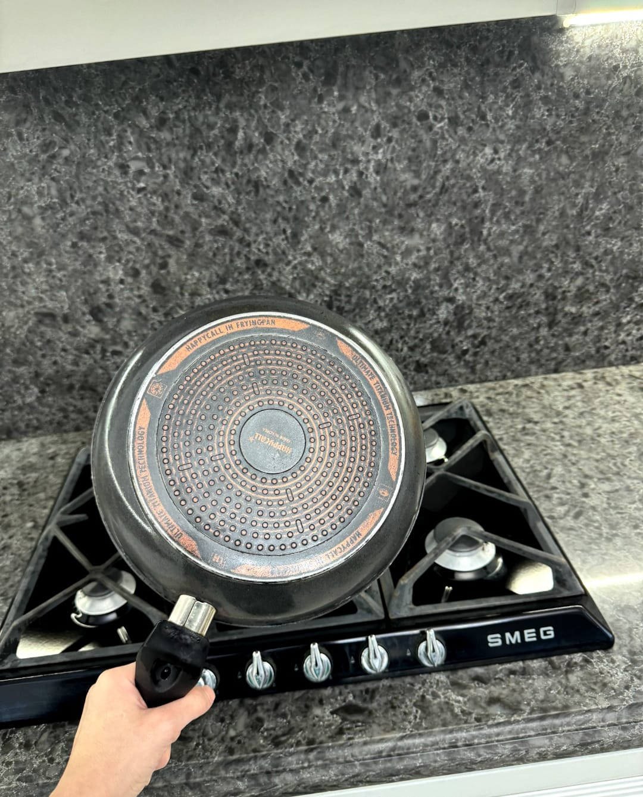

# PemaCleaning - Сервис по уборке с отзывами на Supabase



## О проекте

PemaCleaning — это веб-приложение для сервиса по уборке, которое позволяет пользователям просматривать услуги, рассчитывать стоимость и оставлять отзывы. Проект разработан с использованием чистого HTML, CSS и JavaScript, а для хранения отзывов и фотографий интегрирован с Supabase.

## Функционал

*   **Список услуг:** Подробное описание различных видов уборки с ценами.
*   **Калькулятор стоимости:** Интерактивный калькулятор для расчета примерной стоимости услуг.
*   **Отзывы клиентов:** Раздел, где пользователи могут оставлять текстовые отзывы и прикреплять фотографии (до и после уборки).
*   **Хранение данных на Supabase:** Все отзывы и загруженные фотографии надежно хранятся в базе данных PostgreSQL и объектном хранилище Supabase Storage.
*   **Адаптивный дизайн:** Приложение корректно отображается на различных устройствах.
*   **Админ-режим:** Возможность удаления отзывов (доступно по URL с хешем `#admin`).

## Технологии

*   **Frontend:** HTML5, CSS3, JavaScript (ES6+)
*   **Библиотеки:**
    *   [AOS (Animate On Scroll)](https://michalsnik.github.io/aos/) для анимаций при прокрутке.
    *   [Font Awesome](https://fontawesome.com/) для иконок.
    *   [Supabase JavaScript SDK](https://supabase.com/docs/reference/javascript/initializing) для взаимодействия с бэкендом.
*   **Backend (BaaS):** [Supabase](https://supabase.com/)
    *   **База данных:** PostgreSQL для хранения текстовых данных отзывов.
    *   **Хранилище:** Supabase Storage для хранения изображений.

## Настройка и запуск

Для полноценной работы проекта необходимо настроить Supabase.

### 1. Клонирование репозитория

```bash
git clone git@github.com:TETRIX8/pemaclean_ready.git
cd pemaclean_ready
```

### 2. Настройка Supabase

Следуйте инструкциям в файле `SUPABASE_SETUP.md` для настройки вашего проекта Supabase. Вам потребуется:

*   Создать проект на [Supabase.com](https://supabase.com/).
*   Получить **Project URL** и **Anon Key** из настроек проекта.
*   Вставить эти ключи в файл `reviews.js`.
*   Создать таблицу `reviews` в базе данных PostgreSQL (SQL-скрипт предоставлен в `SUPABASE_SETUP.md`).
*   Создать публичный бакет `review-photos` в Supabase Storage.

### 3. Запуск проекта

После настройки Supabase, вы можете открыть файлы `index.html` или `reviews.html` в вашем браузере. Проект является статическим и не требует локального сервера для запуска.

## Развертывание на Vercel

Проект готов к развертыванию на [Vercel](https://vercel.com/). В корне проекта уже присутствует файл `vercel.json` с необходимой конфигурацией.

1.  Убедитесь, что у вас установлен [Vercel CLI](https://vercel.com/download).
2.  Перейдите в директорию проекта в терминале.
3.  Выполните команду `vercel` для развертывания. Следуйте инструкциям в терминале.

```bash
vercel
```

## Вклад в проект

Приветствуются любые предложения и улучшения. Если вы хотите внести свой вклад, пожалуйста, создайте Pull Request.

## Лицензия

Данный проект распространяется под лицензией MIT. См. файл `LICENSE` для получения дополнительной информации. (Примечание: файл `LICENSE` не включен в текущий проект, но может быть добавлен при необходимости).

---

**Автор:** Manus AI
**Дата:** 24 февраля 2026 г.
